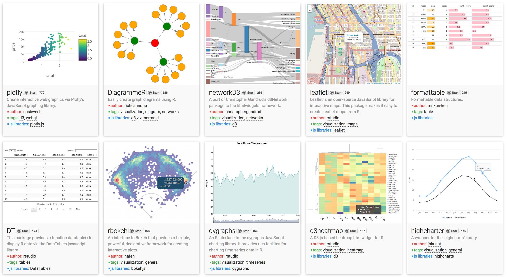
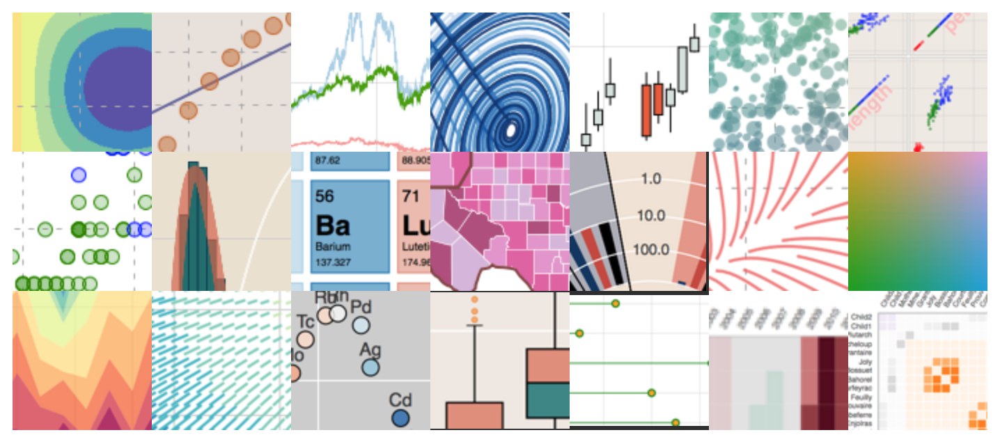

<!--
To run in presentation mode:

command-F1 to toggle mirroring

rmarkdown::run("slides.Rmd", shiny_args=list(port=1234,launch.browser=F))

Run Chrome

http://127.0.0.1:1234/slides.Rmd?presentme=true

Press "p" in the popup window.

Press ctrl-command-f in original window.
-->

<style>
p { color: #000; }
</style>


#


## Presenting data on the web

Viewing a website requires:

* An HTTP client, such as Firefox or Chrome, which displays HTML documents and runs Javascript code. You the application writer don't have much control over the client, but it's reasonably well standardized.

* An HTTP server, running in the language of your choice with all your favourite libraries on the operating system of your choice.

So much effort has gone into writing great HTTP clients that display HTML that it now makes sense to write desktop applications this way as well! An "application" written in this style can run potentially run *anywhere*. Example: RStudio.


## Presenting data on the web

There is a spectrum of choices for where to put most of the interface logic and computation.

* Pure client-side -- The server merely serves static files. All the magic happens in Javascript, client-side.

* RESTful -- The server does the heavy lifting, such as accessing large databases, but doesn't keep track of sessions and state. Client-side Javascript still does quite a lot.

* Stateful server -- The server keeps track of sessions. It possibly runs a separate process per session.

The third option places a lot of load on the server, but is the most flexible.

<div class="notes">
Pure client can't work with large data, without heroic efforts (Dalliance).
</div>


## Shiny


The `shiny` library makes it easy to build stateful servers. When a user interacts with an "app" it's like using a graphical application written in R.

Because the app is written in R, you have all your favourite libraries for analysis and plotting.

Shiny apps are written in a "reactive" style -- outputs are automatically updated when input controls are adjusted by the user.

("Reactive" covers a broad field. For example in Javascript, Facebook's React library is vastly different to Functional Reactive Programming offerings such as Bacon and ReactiveX. Shiny, being server side, doesn't attempt real-time reactivity such as animations, and is relatively simple.)


## Shiny

Shiny is developed by RStudio Inc, who so far look like good citizens in the R community.

GPL3, code is on GitHub.

While some features integrate with RStudio, Shiny is a standalone library and does not require RStudio. It can be used with just a terminal, a web browser, and R.

Shiny Server is a webserver that can serve Shiny apps and Shiny-enhanced Rmarkdown documents. Has an open source and a "pro" version. RStudio Inc also sells Shiny app hosting.

<div style="font-size: 75%">
Yes. Yes. This is a fertile land and we will thrive. We will rule over all this land! And we will call it… this land!
</div>


## Best practice, what best practice?

Without care, Shiny might create a nightmare scenario:

* Analyses that can be only performed via a UI.
* Apps that can't be used as a part of larger apps.
* Complex parameter settings that aren't recorded in either a URL or using R code.

There are ways to avoid this, but they require extra work.


## Other options -- htmlwidgets



<div style="float: right; width: 50%; font-size: 50%; margin-left: 5em;">
```{r message=FALSE, fig.width=4, fig.height=3}
library(plotly)
library(ggplot2)
p <- ggplot(mtcars, aes(x=wt,y=mpg)) + 
    geom_point()
ggplotly(p)
```
</div>

The `htmlwidgets` library provides a way to provide HTML/Javascript widgets in R.

Various libraries use `htmlwidgets` to wrap Javscript plotting libraries, such as `plotly`.

These can be used in static Rmarkdown documents or via Shiny.

## Other options -- Bokeh



Python library with similar features to both `htmlwidgets` and `shiny`.

Bokeh has a heavy emphasis on rendering plots client side, but also has a server component. 

Not "reactive", updates are propagated using event handlers.

## Summing up

Shiny might not be your long-term solution, it's not great at scale, but it's probably your initial prototype.

Shiny and R in general are great for people with just a little computing experience. RStudio Inc has done something amazing in making R and Shiny as accessible as they are. For example, Shiny is a suitable basis for a summer or honours project for undergraduate students.


## Acknowledgements

Adele Baraguhare (Monash Bioinformatics Platform) 

Andrew Pattison (PhD student, RNA Systems Biology Lab) 

have previously taught classes on Shiny at Monash University.


